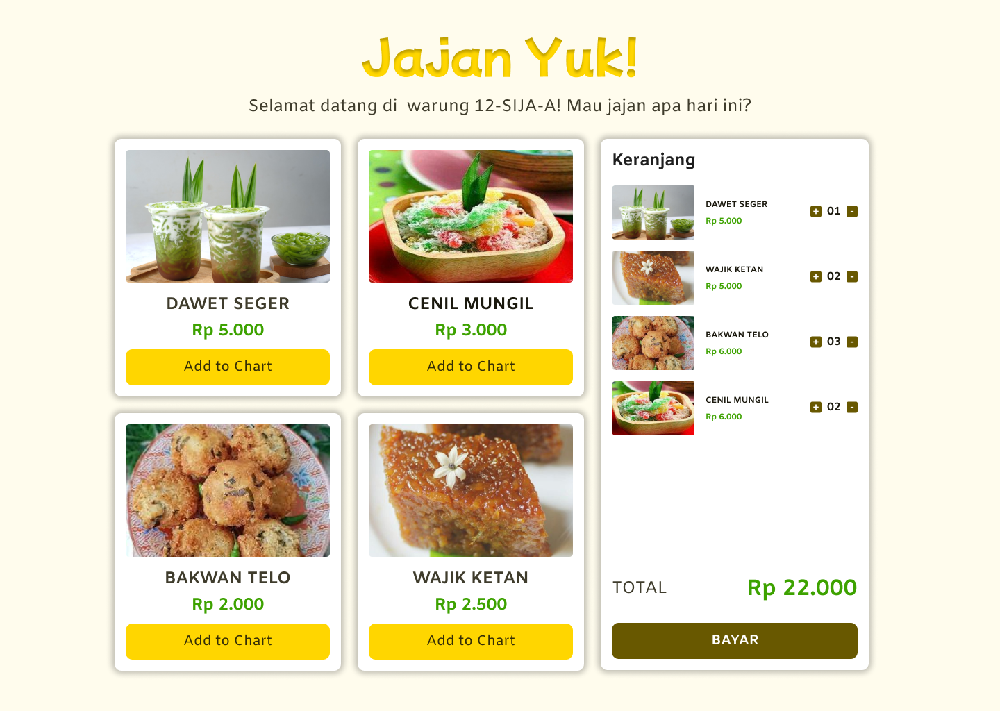
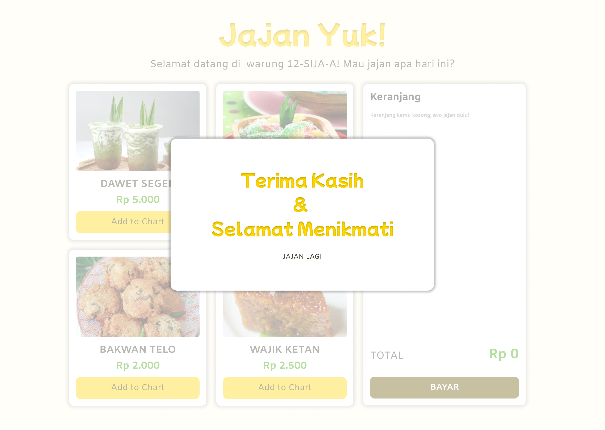

# Kasir "Jajan Yuk"
A simple cashier web app with html , css, and javascript that create as a medium for decorating our traditional food booth that held during P5 week 2023 in SMKN 2 Depok Sleman 

## UI Design

## Follow Us
- [Instagram](https://www.instagram.com/dualima.sijaa/)

## Build By
- [Fatimah Ayu](https://github.com/upilkecebong)
- [Anas Merza](https://github.com/anaseaq)